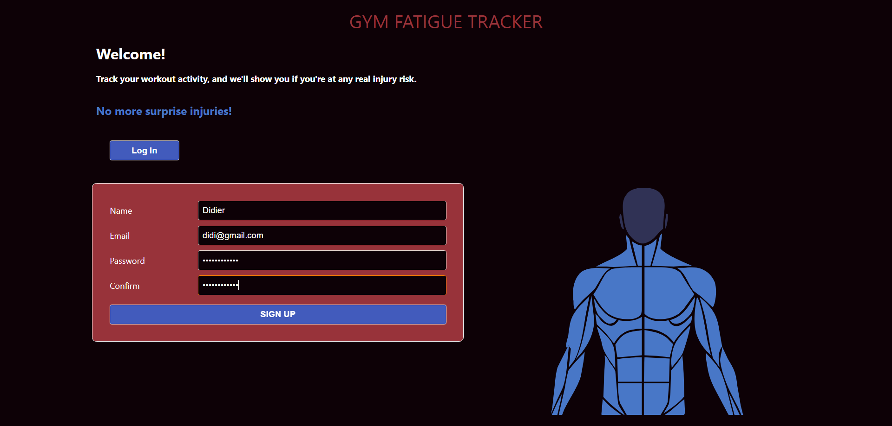
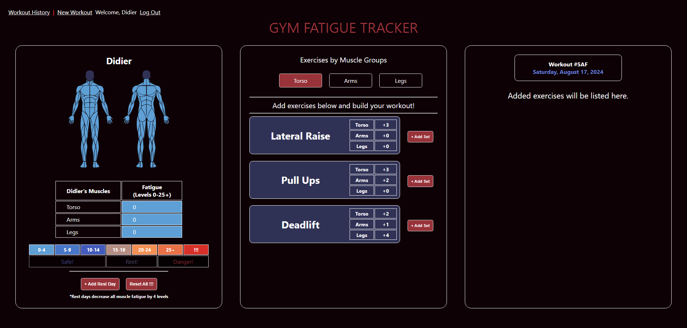
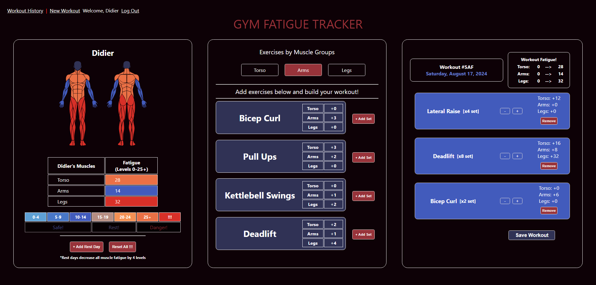
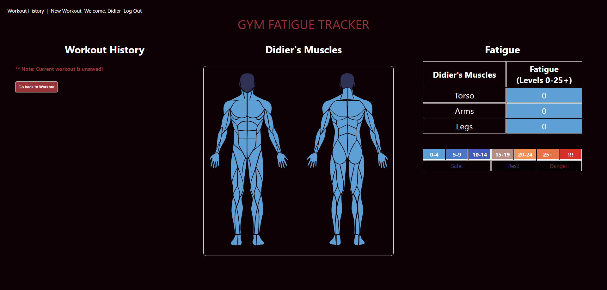
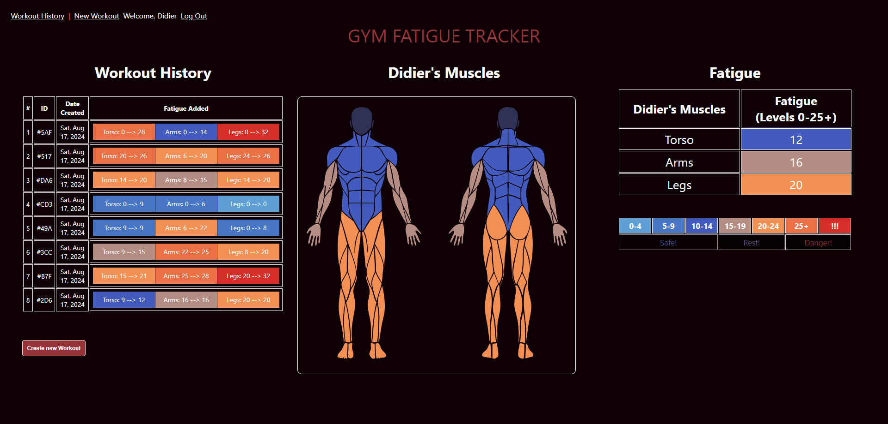

# Gym Fatigue Tracker! (Fatigue Data Visualisation App)

**Unit 4 Project - MERN Full-stack Application MongoDB/Node/Express/React**

## Description

**This is an app for gym goers (that do weight training) that tracks your muscle fatigue each time you workout to help you prevent overtraining risks and injuries.**

 
Easy user-friendly app built for anyone to calculate costs for anything.
For personal home projects, for your best friend's backyard, or more comprehensive lists for contractors looking to make quick quotes for clients.

## Getting Started!

**Here's a link to my app!:** https://project-4-4wu0.onrender.com/

Trello Link: https://trello.com/b/z6gwByEL/project-4-gym-fatigue-tracking-app

## Screenshots

**Login Page**

**Signup Page**

## Technology Used

MERN Stack:
MongoDB, Express, React, Node

  (Created in Visual Studio Code)

## Next Steps

- Refactor for more client-side routing/rendering for responsiveness.
- Add functionality so user fatigue levels reduce each real day!
- Create compatible Mobile Browser App
